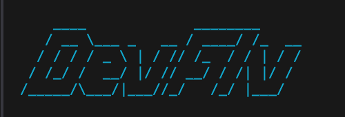

<div align="center">
  
</div>

# DevFix 🛠️

**The open-source autonomous agent that detects, diagnoses, and fixes broken local development environments.**

 <!-- Placeholder for a future gif -->

The biggest problem with current AI coding assistants (like Copilot or Cursor) is that they operate entirely on text generation. They give you code and confidently say "I fixed it!", leaving *you* to run the commands, test the environment, and verify if it actually worked.

**DevFix changes that.** 

DevFix is a sandboxed agentic workflow. You give it a broken project, and it spins up a secure Docker environment, investigates the root cause, patches files, runs shell commands, and **verifies its own fixes**. 

It does not stop until your build scripts actually succeed.

## ✨ Why DevFix?

Most AI tools guess. DevFix proves it. 

1. **Self-Verifying (Deterministic Verifier Layer):** DevFix removes the AI's ability to "hallucinate" a success. It actively runs your test suite (`npm run build`, `pytest`, etc.). Only when the environment proves the fix works does the agent complete its task.
2. **Highly Secure (Sandboxed Execution):** Giving an AI access to run arbitrary bash commands on your laptop is dangerous. DevFix isolates all actions inside a secure, ephemeral Docker container. It cannot harm your host machine.
3. **Language Agnostic Detection:** Point DevFix at any directory. It automatically reads your lockfiles, `package.json`, or `requirements.txt` to figure out if you're running Node, Python, or TypeScript without you needing to configure anything.

## 🚀 Quick Start

### Installation

DevFix is available globally via NPM:

```bash
npm install -g devfix
```

### Usage

**1. Inspect your project**
Curious what DevFix sees? Run this in your project root. It performs a read-only scan to detect your environment:
```bash
devfix inspect .
```

**2. Fix your project (Coming Soon)**
The core fix loop is currently optimized for our internal 10-case benchmark. The global `devfix fix .` command is actively being stabilized for public release.

### Run the Benchmark
If you want to see DevFix in action immediately, you can run our rigorous 10-case failure benchmark locally:
```bash
devfix benchmark
```

## 🗺️ Roadmap & Future Scope

DevFix was originally born as a highly successful hackathon project, achieving an 80% autonomous recovery rate on severely broken environments. We are now evolving it into a production-grade developer tool.

**Current Capabilities:**
- Full support for Node.js (npm, yarn, pnpm), TypeScript, and Python.
- Secure Docker sandboxing.
- Autonomous file patching and shell execution.

**Coming Soon (We need your help!):**
- [ ] Support for **Rust**, **Go**, and **Java**.
- [ ] **VS Code Extension:** Seamlessly trigger DevFix directly from your editor when a terminal command fails.
- [ ] **Cloud Sandboxing:** Run fixes on remote infrastructure instead of local Docker.
- [ ] **Custom Verifiers:** Allow users to define their own success criteria (e.g., `devfix fix --verify "curl localhost:3000"`).

## 🤝 Contributing (Awaiting PRs!)

DevFix is in active, early-stage development, and we are heavily awaiting Pull Requests from the community! 

Whether you want to add support for a new language (like Go or Rust), improve the AI prompts, or help build the upcoming VS Code extension, your contributions are welcome.

1. Fork the repository.
2. Run `npm install` to install dependencies.
3. Run `npm run test` to ensure the core engine is stable.
4. Submit a Pull Request!

Please read our [Documentation](https://devfix.ghulam-mustafa.com) for a deep dive into the architecture and system design.

## 📄 License

MIT License. Copyright © 2024-present Ghulam Mustafa.
