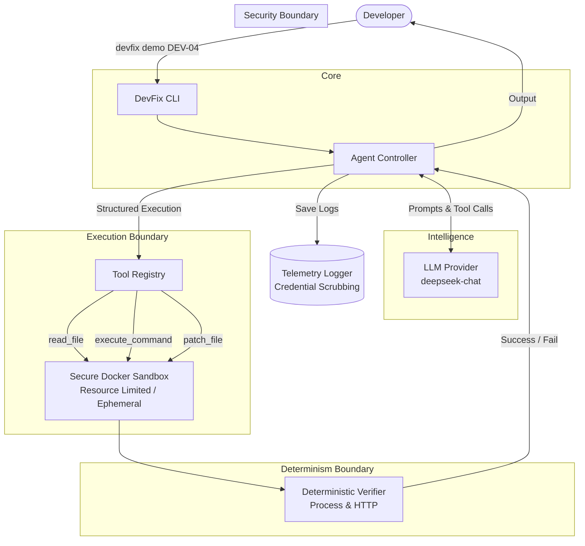

# DevFix Architecture

The architecture of DevFix strictly separates the intelligence of the Agent from the validation logic. This creates a secure, deterministic boundary where the LLM cannot self-certify its success.

## Core Flow

## Boundaries

1. **Security Boundary (Sandbox)**:
   The LLM agent investigates the codebase using the Tool Registry. Every action taken by the tool registry runs exclusively inside an isolated Docker container, protecting the host system from potentially destructive commands.

2. **Determinism Boundary (Verifier)**:
   Unlike typical LLM agent workflows where the model decides if it has completed a task, DevFix uses deterministic heuristics (checking process exit codes or HTTP status responses). If the agent fails to truly repair the environment, the verifier will return a failure and force the agent to continue its investigation.

3. **Telemetry Boundary**:
   Before writing any conversation output to disk, the `TelemetryLogger` parses all output arrays, redacting known credential schemas (`sk-`, `Bearer`, etc.) to prevent secret leaks during presentation.
